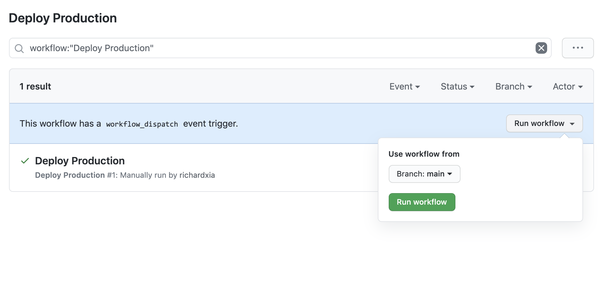

# ShelterTech.org Website 

> Created with [Gatsby](https://www.gatsbyjs.org/) with content managed in [Prismic](https://prismic.io)


## Development Environment Setup

### Requirements

Docker Desktop

Follow the [Docker installation instructions](https://www.docker.com/get-started) for your OS.

### Installing dependencies

This only needs to be run once on first setup, and once any time the
dependencies in package.json change.

```sh
$ docker-compose run --rm app npm install
```


## Gatsby Commands

Gatsby is a React-based framework for generating static websites. The following
are common commands you will use while developing the website.

### Start Gatsby development web server

```sh
$ docker-compose up app
```

This will start the development web server at http://localhost:8000. The
development server will automatically refresh your browser when any source file
is modified.

Press Ctrl + C to exit the development web server.

### Build production site bundle

```sh
$ docker-compose run --rm app npm run build
```

This command will build a bundle of static files that can be deployed directly
to a static web server host. The files will be located in the `./public`
directory.


## Storybook Commands

[Storybook](https://storybook.js.org/) is a tool for developing reusable UI
components. When developing a new component, it is recommended to first develop
it in Storybook in order to encourage building it as a modular, isolated component
before including it in the Gatsby-based site.

### Start Storybook development web server

```sh
$ docker-compose up storybook
```

This will start the development web server at http://localhost:6006. The
development server will automatically refresh your browser when any source file
is modified.


## General Commands

### Run code lint checks

```sh
# Run this to automatically fix lint issues
$ docker-compose run --rm app npm run lint:fix

# Run this to just check for lint issues without fixing them
$ docker-compose run --rm app npm run lint
```


## Deployments

sheltertech.org has two deployment environments: staging.sheltertech.org and
www.sheltertech.org. Both are hosted on [AWS S3](https://aws.amazon.com/s3/)
buckets, and the deployments are both done via
[GitHub Actions](https://docs.github.com/en/actions).

Staging deployments are automatically triggered when a pull request is merged
into the `main` branch.

Production deployments must be manually triggered from the GitHub web interface.
To deploy, click on the
[Actions](https://github.com/ShelterTechSF/sheltertech.org/actions) tab from any
GitHub page within the sheltertech.org repository, and then click on the
[Deploy Production](https://github.com/ShelterTechSF/sheltertech.org/actions?query=workflow%3A%22Deploy+Production%22)
workflow on the left side bar. Then click the **Run workflow** button on the
right side, select the `main` branch, and then click the green **Run workflow**
button. After the workflow finishes running, you should see the updated site at
www.sheltertech.org.




## Change content in Site

> [ShelterTech Content in Prismic](https://sheltertech.prismic.io/)

